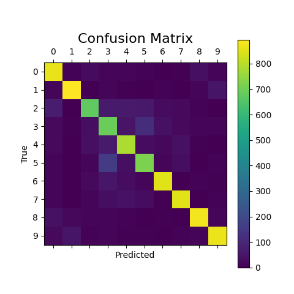
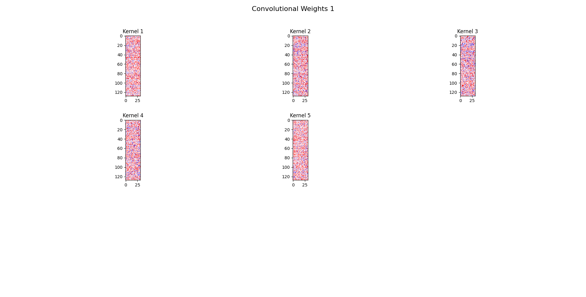
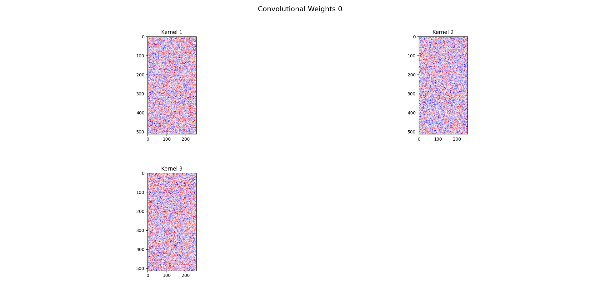
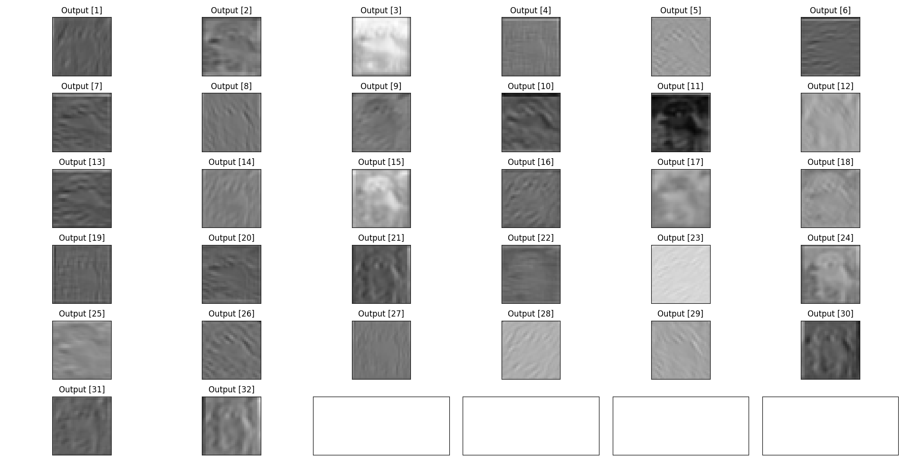
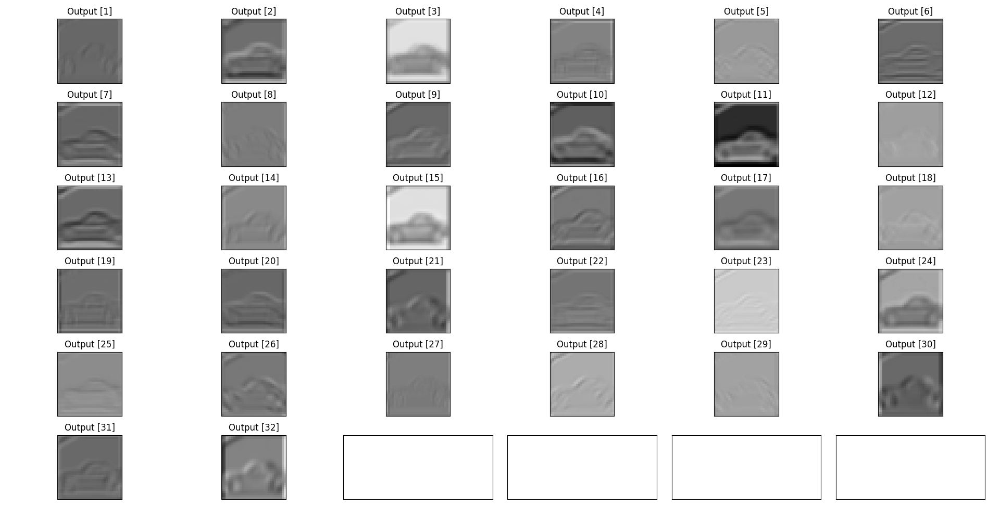
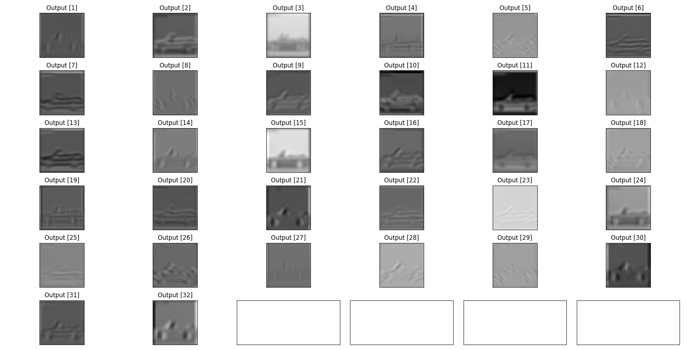

# CNN Image classifier

This project implements a Convolutional Neural Network (CNN) to classify images from the CIFAR-10 dataset. It includes versions in both PyTorch and TensorFlow, utilizing additional libraries such as scikit-learn, NumPy, and Matplotlib.

## Installation

To install the project dependencies, you can use the `requirements.txt` file. Run the following command:

```bash
pip install -r requirements.txt
```


## Usage

### Running the model in PyTorch

To train and test the CNN using PyTorch, execute:

```bash
python main_torch.py
```

### Running the model in TensorFlow

To train and test the CNN using TensorFlow, execute:

```bash
python main_tf.py
```

## Features

- **Training and Evaluation**: Both versions allow for model training and evaluation on the CIFAR-10 dataset.
- **Visualization**: Utilizes Matplotlib to visualize images and results.

## Dataset

The CIFAR-10 dataset is a widely used dataset for image classification. It contains 60,000 images across 10 different classes, with 6,000 images per class. The classes include:

- Airplanes
- Automobiles
- Birds
- Cats
- Deer
- Dogs
- Frogs
- Horses
- Ships
- Trucks


### How to contribute:

1. Fork the repository.
2. Create a new branch 
3. Make your changes.
4. Commit your changes 
5. Push to your branch 
6. Create a pull request to the main branch of the original repository.

Please make sure to follow the existing coding style.

I appreciate your contributions! 
## Images









